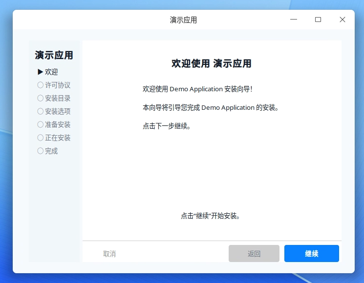

# go-pkg-installer

A Linux installation framework written in Go, inspired by macOS `.pkg` installers.

- 中文版文档: `README.zh-CN.md`

## Overview

`go-pkg-installer` is a **Go library** that provides a configurable, extensible installation framework for Linux applications. It is designed for building GUI installers and uninstallers with a pluggable workflow engine.

### Highlights

- **Pluggable UI**: Built-in tk9-based wizard UI, plus support for custom screens.
- **Pluggable Tasks**: Built-in task types and a registry for user-defined tasks.
- **Configurable Workflow**: YAML-driven flow with guards, branching, and step routing.
- **Uninstall Support**: The same engine supports install/uninstall/repair/upgrade actions.

## Screenshot



## Quick Start

### Install

```bash
go get github.com/HanHan666666/go-pkg-installer
```

### Run the built-in GUI installer

```bash
go run ./cmd/installer --config installer.yaml
```

### CLI options

```
Usage: installer [options]

Options:
  -config string    Path to installer configuration YAML file
  -action string    Action to perform: install, uninstall (default "install")
  -validate         Only validate the configuration file
  -headless         Run in headless/CLI mode (no GUI)
  -verbose          Enable verbose logging
  -version          Show version information
```

## Configuration

### Minimal example

```yaml
product:
  name: "My Application"

flows:
  install:
    entry: welcome
    steps:
      - id: welcome
        title: "Welcome"
        screen:
          type: welcome
          content: "Welcome to My Application installer!"

      - id: license
        title: "License"
        screen:
          type: license
          source: "path/to/LICENSE.txt"
        guards:
          - type: mustAccept
            field: license_accepted

      - id: destination
        title: "Install Location"
        screen:
          type: pathPicker
          bind: install_dir

      - id: summary
        title: "Ready to Install"
        screen:
          type: summary

      - id: progress
        title: "Installing"
        screen:
          type: progress
        tasks:
          - type: shell
            command: "mkdir"
            args: ["-p", "${install_dir}"]
          - type: writeConfig
            destination: "${install_dir}/config.json"
            format: json
            content:
              installed: true

      - id: finish
        title: "Complete"
        screen:
          type: finish
```

### Supported actions

- `install`: Standard installation flow
- `uninstall`: Removal flow for installed files
- `upgrade`: Upgrade flow (optional)
- `repair`: Repair/restore flow (optional)

## Architecture

### Core modules

- **core**: Workflow engine, context, task runner, event bus
- **builtin**: Built-in tasks, guards, and screen defaults
- **schema**: YAML/JSON schema validation
- **ui**: tk9-based GUI renderer

### Built-in screen types

| Type | Description |
|------|-------------|
| `welcome` | Welcome screen with rich text |
| `license` | License with scroll-to-end and accept checkbox |
| `pathPicker` | Directory selection for install location |
| `options` | Multiple-choice options |
| `detect` | Run step tasks on entry and show concise status text |
| `summary` | Pre-install summary |
| `progress` | Progress and live logs |
| `finish` | Completion screen |

### Detect screen

The `detect` screen runs the current step’s `tasks` as soon as the page is shown. While tasks run, it displays a short “detecting” message (from `description`). After tasks finish, it renders the final `content` using context variables.

```yaml
- id: detect
  title: "Check System"
  screen:
    type: detect
    title: "Check System"
    description: "Detecting environment..."
    content: |
      Detected info: ${env.some_field}
      Please confirm and continue.
  tasks:
    - type: go:someTask
      param: "value"
```

### Built-in tasks

| Task | Description |
|------|-------------|
| `shell` | Execute shell commands |
| `copy` | Copy files/directories |
| `symlink` | Create symlinks |
| `writeConfig` | Write config files |
| `removePath` | Remove files/directories |
| `desktop_entry` | Create .desktop entries |
| `download` | Download files |
| `unpack` | Extract archives (tar/zip) |

### Built-in guards

| Guard | Description |
|-------|-------------|
| `mustAccept` | Require acceptance checkbox |
| `diskSpace` | Check available disk space |
| `fieldNotEmpty` | Validate required fields |
| `expression` | Custom expression evaluation |

## Extending

### Custom task

```go
func init() {
    core.Tasks.MustRegister("myTask", func(params map[string]any, ctx *core.InstallContext) (core.Task, error) {
        return &MyTask{BaseTask: core.NewBaseTask("myTask", "my-task", params)}, nil
    })
}

type MyTask struct {
    core.BaseTask
}

func (t *MyTask) Execute(ctx *core.InstallContext) error {
    // Implementation
    return nil
}

func (t *MyTask) Validate(ctx *core.InstallContext) error {
    return nil
}
```

### Custom guard

```go
func init() {
    core.Guards.MustRegister("myGuard", func(params map[string]any, ctx *core.InstallContext) (core.Guard, error) {
        return &MyGuard{params: params}, nil
    })
}
```

### Custom screen

```go
func init() {
    ui.RegisterScreenRenderer("myScreen", NewMyScreen)
}
```

## Development

### Build

```bash
make build
```

### Test

```bash
make test
```

### Lint

```bash
make lint
```

## License

MIT License - see [LICENSE](LICENSE) for details.
